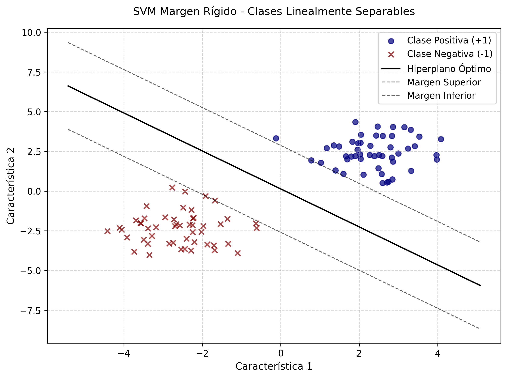
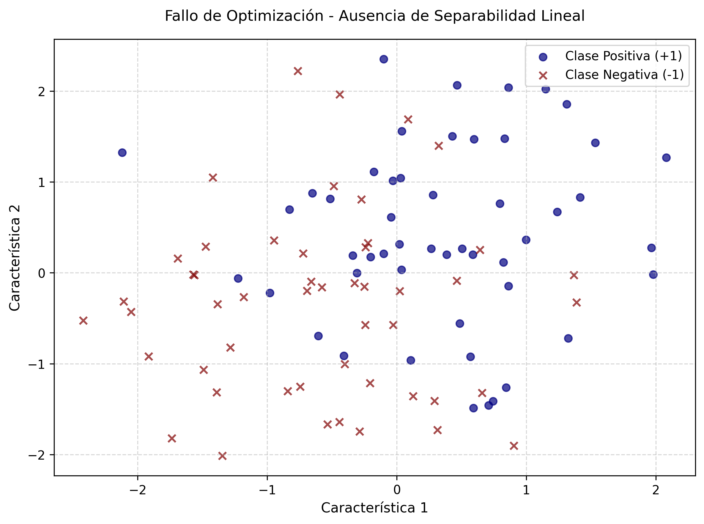
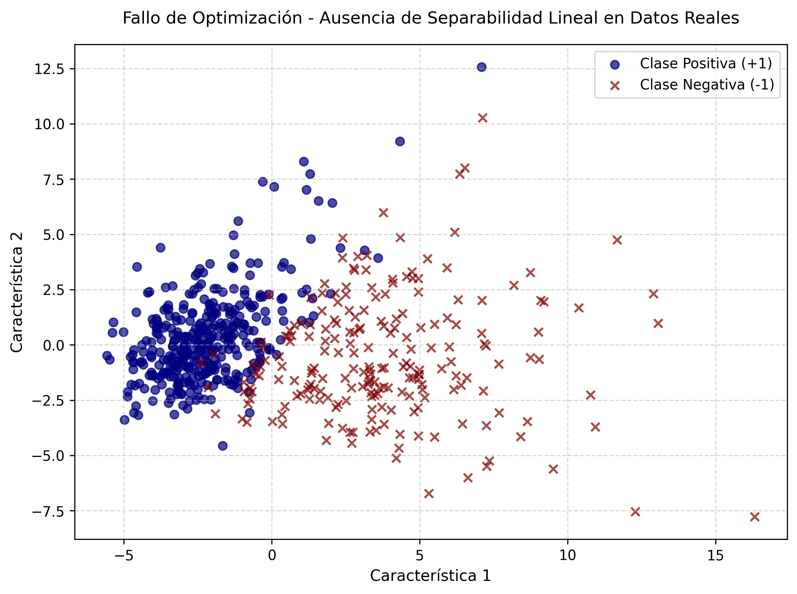

# SVM de Margen Rígido (Hard Margin)

---

Este repositorio contiene la implementación académica de una Máquina de Vectores de Soporte (SVM) operando bajo la estricta formulación de **Margen Rígido**. Este algoritmo es la base teórica de las SVM, diseñado para encontrar el hiperplano que maximiza la separación entre dos clases linealmente separables.

## 1. Estructura del código

Este proyecto está organizado para facilitar la trazabilidad de los experimentos.

* ``src/``: Contiene el código fuente principal ([main.py](./src/main.py "Código fuente")).
* ``data/``: Almacena los resultados tabulados en formato CSV y Excel.
* ``images/``: Contiene la visualización de los hiperplanos óptimos y los márgenes.

## 2. Guía de Ejecución

### Requisitos Previos

Asegúrese de tener instalado el entorno de Python con las bibliotecas necesarias:

```bash
pip install numpy pandas scipy matplotlib scikit-learn
```

### Ejecución

Para evaluar los tres escenarios (datos separables, superpuestos y empíricos), ejecute:

```bash
cd src
python main.py
```

## 3. Descripción del Código

El sistema está diseñado para demostrar la rigidez matemática de este modelo.

### Formulación Matemática

* **Función Objetivo:**
  $\min_{w, b} \frac{1}{2} ||w||^2$
* **Restricción:**
  $y_i (w^T x_i + b) \geq 1, \quad \forall i = 1, \dots, n$

Donde:

* $w$ es el vector normal al hiperplano.
* $b$ es el término de sesgo (_bias_).
* $x_i$ son los vectores de entrada.
* $y_i \in \{-1, 1\}$ son las etiquetas de clase. _(Nota técnica: La elección algebraica de +1 y -1 como etiquetas no es arbitraria; permite condensar las restricciones de ambas clases en una única inecuación maestra, haciendo posible la optimización convexa)._

### Funciones Principales

* `fit_svm()`: Ajusta el modelo SVM mediante optimización primal (`SLSQP`).
* `plot_svm()`: Visualiza el hiperplano óptimo y los márgenes de separación (`Margen Superior` y `Margen Inferior`).

## 4. Análisis de Resultados

El experimento evalúa la capacidad del modelo para separar datos bajo dos condiciones distintas.

### Escenarios de Prueba

| Escenario                                | Resultado              | Interpretación                                                                                                                 |
| ---------------------------------------- | ---------------------- | ------------------------------------------------------------------------------------------------------------------------------- |
| Datos separables<br />(Sintético)       | Convergencia exitosa   | El modelo encuentra con éxito el hiperplano de margen máximo.                                                                 |
| Datos superpuestos<br />(Sintético)     | Fallo en optimización | La región factible es vacía; el modelo colapsa ante la falta de separabilidad.                                                |
| Breast Cancer Wisconsin<br />(Empírico) | Fallo en optimización | Demostración práctica: Los datos oncológicos reales (reducidos vía PCA) presentan superposición natural. El modelo aborta. |

<div style="display: flex; flex-direction: row; justify-content: space-between;">
  
  
  
</div>

* **Interpretación del fallo:** La divergencia en los conjuntos superpuesto y empírico, manifestada como Positive directional derivative for linesearch en consola, es la validación empírica fundamental. En un SVM de margen rígido, no existe un hiperplano que cumpla $y_i(w^T x_i + b) ≥ 1$ para todos los puntos simultáneamente cuando las clases se solapan. Matemáticamente, el optimizador intenta forzar una solución imposible y, ante la imposibilidad de satisfacer las restricciones, aborta la operación.

## 5. Conclusión

El SVM de Margen Rígido es una pieza fundamental de la teoría de aprendizaje estadístico. Aunque su capacidad de generalización es excelente en entornos ideales, su principal limitación es la fragilidad ante el ruido. Los resultados obtenidos confirman que, para conjuntos de datos del mundo real donde las clases no son perfectamente separables, es indispensable migrar hacia una formulación de [Margen Suave (Soft Margin)](https://github.com/gustavoerivero/SVM/tree/main/02_Soft_Margin), la cual introduce variables de holgura para permitir violaciones al margen y garantizar la convergencia del modelo.

---

⌨️ made with ❤️ by [Gustavo Rivero](https://github.com/gustavoerivero)
