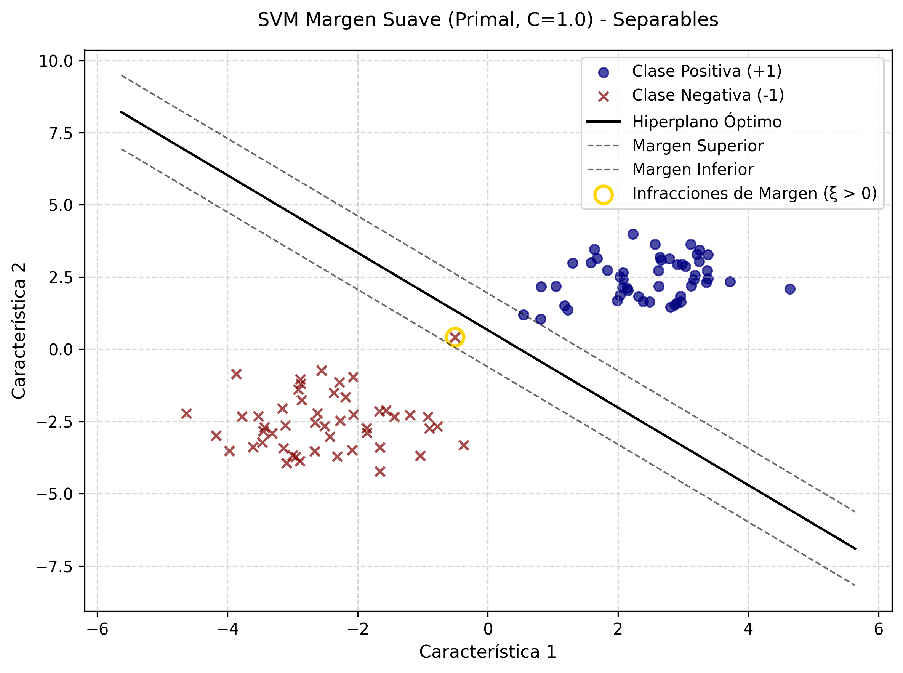
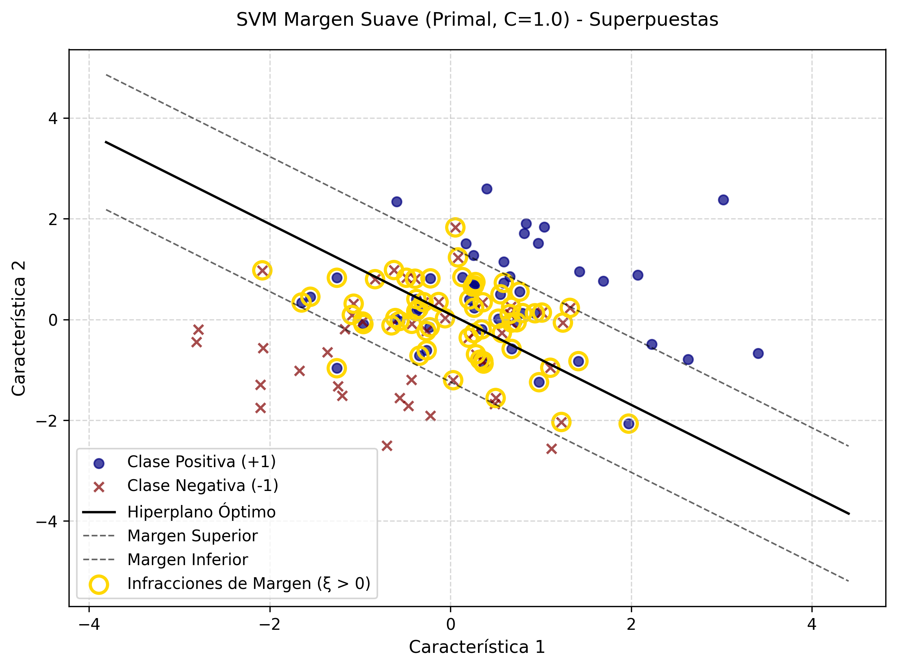

# SVM de Margen Suave (Soft Margin)

---

Este repositorio contiene la implementación de una Máquina de Vectores de Soporte (SVM) extendida mediante la formulación primal con variables de holgura. A diferencia del margen rígido, este modelo introduce una tolerancia al error, permitiendo la clasificación de conjuntos de datos donde la separabilidad lineal perfecta no es posible.

## 1. Estructura del código

Este proyecto está organizado para facilitar la trazabilidad de los experimentos.

* ``src/``: Contiene el código fuente principal ([main.py](./src/main.py "Código fuente")).
* ``data/``: Almacena los resultados tabulados en formato CSV, incluyendo las variables de holgura.
* ``images/``: Contiene la visualización de las fronteras de decisión y las infracciones de margen.

## 2. Guía de Ejecución

### Requisitos Previos

Asegúrese de tener instalado el entorno de Python con las bibliotecas necesarias:

```bash
pip install numpy pandas scipy matplotlib
```

### Ejecución

Para evaluar ambos escenarios (datos separables y superpuestos), ejecute:

```bash
cd src
python main.py
```

## 3. Descripción del Código

El sistema está diseñado para demostrar cómo la flexibilidad matemática permite la convergencia incluso en escenarios complejos.

### Formulación Matemática

* **Función Objetivo:**
  $\min_{w, b, \xi} \frac{1}{2} ||w||^2 + C \sum_{i} \xi_i$
* **Restricción:**
  $y_i (w^T x_i + b) \geq 1 - \xi_i, \quad \xi_i \geq 0$

Donde:

* $C$ es el parámetro de regularización que controla el balance entre el margen y el error.
* $\xi_i$ (slack variables) cuantifican la invasión del margen para cada muestra $i$.

### Funciones Principales

* `fit_primal_soft_margin()`: Ajusta el modelo SVM mediante la optimización primal (SLSQP), minimizando la suma de la norma del vector de pesos y la penalización de las holguras.
* `plot_svm()`: Visualiza el hiperplano óptimo y resalta, mediante nodos dorados, las muestras que invaden el margen ($\xi > 0$).

## 4. Análisis de Resultados

El experimento demuestra la robustez del Margen Suave frente al colapso del Margen Rígido.

### Escenarios de Prueba

| Escenario          | Resultado            | Interpretación                                                                             |
| ------------------ | -------------------- | ------------------------------------------------------------------------------------------- |
| Datos separables   | Convergencia exitosa | Las variables de holgura tienden a cero, comportándose como un margen rígido.             |
| Datos superpuestos | Convergencia exitosa | Gracias a$\xi$, el modelo absorbe el ruido permitiendo una frontera de decisión válida. |

<div style="display: flex; flex-direction: row;">
  
  
</div>

* **Interpretación de los hallazgos:** A diferencia de la formulación rígida, el modelo de margen suave logra converger en el conjunto de datos superpuestos. Los nodos resaltados en dorado en la figura de la derecha representan las muestras que violan las condiciones del margen ($\xi > 0$). Estas variables de holgura actúan como una "red de seguridad" matemática que impide que el modelo colapse ante la falta de separabilidad lineal perfecta.

## 5. Conclusión

La implementación de la formulación primal con variables de holgura representa un avance significativo respecto al Margen Rígido. Este modelo nos permite gestionar datos del mundo real caracterizados por el ruido y la superposición de clases, manteniendo la elegancia matemática de la optimización convexa. La capacidad de identificar las infracciones de margen mediante los valores de $\xi$ nos brinda una herramienta diagnóstica invaluable para entender la calidad y la separabilidad inherente de nuestros datos.

---

⌨️ made with ❤️ by [Gustavo Rivero](https://github.com/gustavoerivero)
