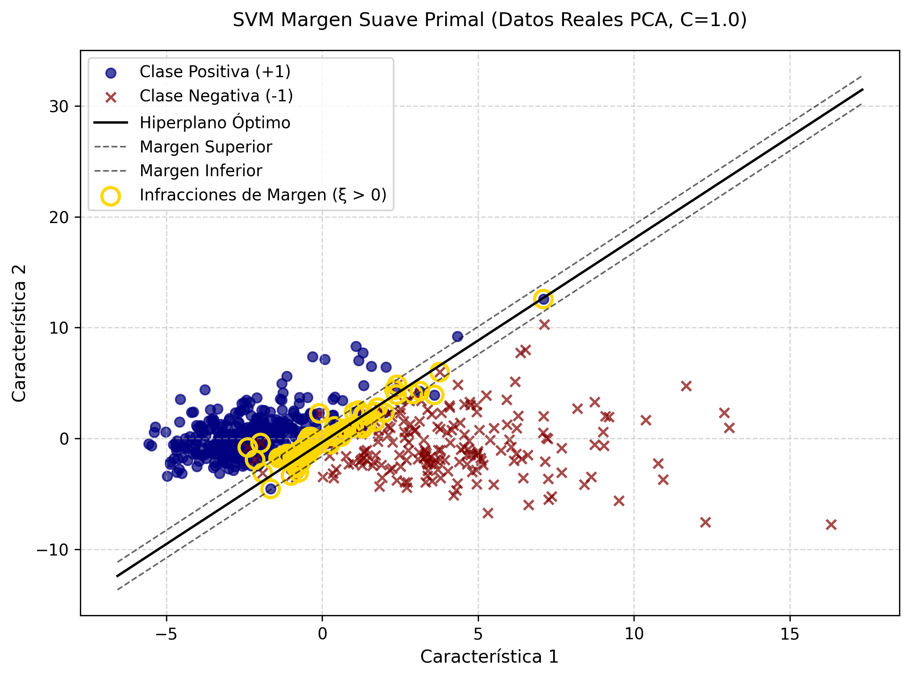

# SVM de Margen Suave (Soft Margin) - Formulación Primal

---

Este repositorio contiene la implementación académica de una Máquina de Vectores de Soporte (SVM) extendida mediante la **formulación primal con variables de holgura**. A diferencia del margen rígido, este modelo introduce una tolerancia al error, permitiendo la clasificación de conjuntos de datos empíricos y ruidosos donde la separabilidad lineal perfecta no es posible.

## 1. Estructura del código

Este proyecto está organizado para facilitar la trazabilidad de los experimentos.

* ``src/``: Contiene el código fuente principal ([main.py](./src/main.py "Código fuente")).
* ``data/``: Almacena los resultados tabulados en formato CSV, incluyendo las variables de holgura.
* ``images/``: Contiene la visualización de las fronteras de decisión y las infracciones de margen.

## 2. Guía de Ejecución

### Requisitos Previos

Asegúrese de tener instalado el entorno de Python con las bibliotecas necesarias:

```bash
pip install numpy pandas scipy matplotlib scikit-learn
```

### Ejecución

Para evaluar la capacidad del modelo frente a los tres escenarios de complejidad creciente (separables, superpuestos y empíricos), ejecute:

```bash
cd src
python main.py
```

## 3. Descripción del Código

El sistema está diseñado para demostrar cómo la flexibilidad matemática permite la convergencia incluso en escenarios complejos.

### Formulación Matemática

* **Función Objetivo:**
  $\min_{w, b, \xi} \frac{1}{2} ||w||^2 + C \sum_{i} \xi_i$
* **Restricción:**
  $y_i (w^T x_i + b) \geq 1 - \xi_i, \quad \xi_i \geq 0$

Donde:

* $w$ es el vector normal al hiperplano.
* $b$ es el término de sesgo (_bias_).
* $C$ es el parámetro de regularización que controla el balance entre el margen y el error.
* $\xi_i$ (slack variables) cuantifican la invasión del margen para cada muestra $i$.
* $y_i \in \{-1, 1\}$ son las etiquetas de clase. 

### Funciones Principales

* `fit_primal_soft_margin()`: Ajusta el modelo SVM mediante la optimización primal (SLSQP), minimizando la suma de la norma del vector de pesos y la penalización de las holguras.
* `plot_svm()`: Visualiza el hiperplano óptimo y resalta, mediante nodos amarillos, las muestras que invaden el margen ($\xi > 0$).

## 4. Análisis de Resultados

El experimento demuestra la robustez del Margen Suave frente al colapso del Margen Rígido.

### Escenarios de Prueba

| Escenario                                | Resultado            | Interpretación                                                                                                                                                                    |
| ---------------------------------------- | -------------------- | ---------------------------------------------------------------------------------------------------------------------------------------------------------------------------------- |
| Datos separables<br />(Sintético)       | Convergencia exitosa | Las variables de holgura tienden a cero (**$\xi \approx 0$**). El modelo prioriza la maximización del margen, comportándose de manera análoga al margen rígido.        |
| Datos superpuestos<br />(Sintético)     | Convergencia exitosa | Gracias a**$\xi_i$**, el modelo absorbe el ruido posibilitando el trazado de una frontera de decisión válida a cambio de una penalización regulada por **$C$**. |
| Breast Cancer Wisconsin<br />(Empírico) | Convergencia exitosa | Demostración práctica: El algoritmo logra clasificar datos oncológicos superpuestos (proyectados vía PCA) aislando y marcando los casos médicos "atípicos".                  |

<div style="display: flex; flex-direction: row; justify-content: space-between;">
  
  
  
</div>

* **Interpretación de los hallazgos:** A diferencia de la formulación rígida que colapsaría irremediablemente ante el conjunto empírico de cáncer de mama, el modelo de margen suave logra converger aislando el ruido. Los nodos resaltados en amarillo representan las muestras que violan las condiciones del margen ($\xi > 0$). Estas variables de holgura actúan como una "red de seguridad" matemática que impide el fallo del optimizador.

## 5. Conclusión

La implementación de la formulación primal con variables de holgura representa un avance insustituible respecto al Margen Rígido. Este modelo nos permite gestionar datos del mundo real caracterizados por el ruido intrínseco y la superposición de clases manteniendo la optimización convexa. Adicionalmente, la capacidad de extraer e identificar numéricamente las infracciones de margen ($\xi > 0$) nos brinda una herramienta diagnóstica para auditar la separabilidad de nuestros datos.

---

⌨️ made with ❤️ by [Gustavo Rivero](https://github.com/gustavoerivero)
