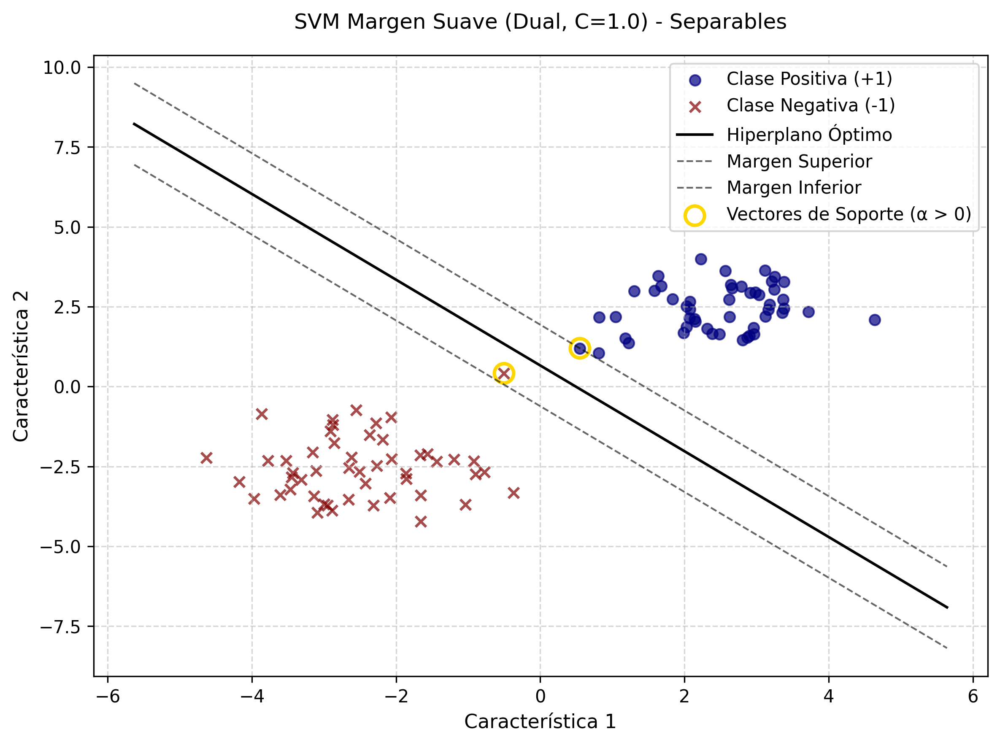
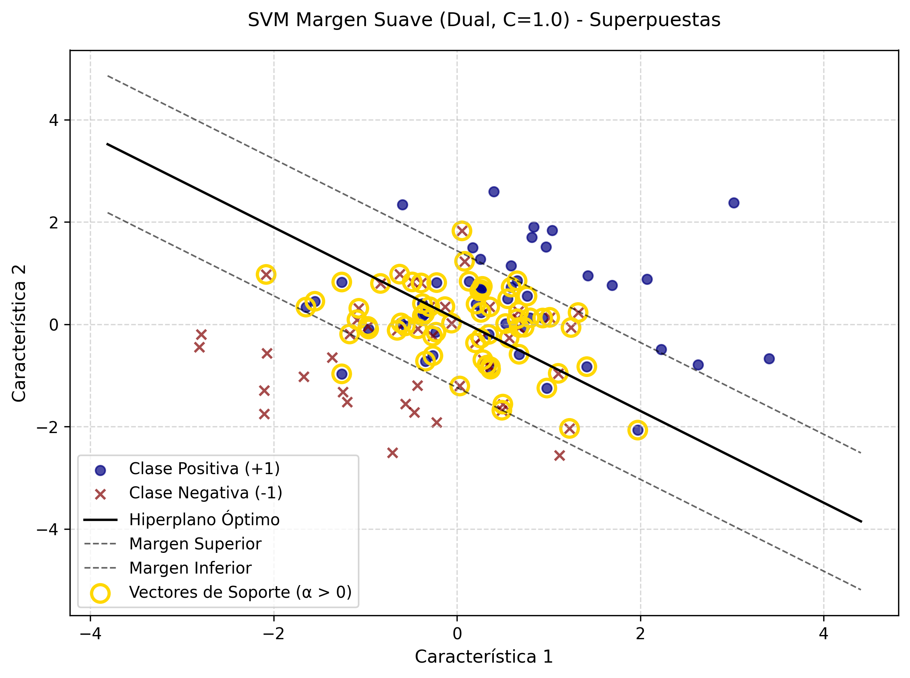
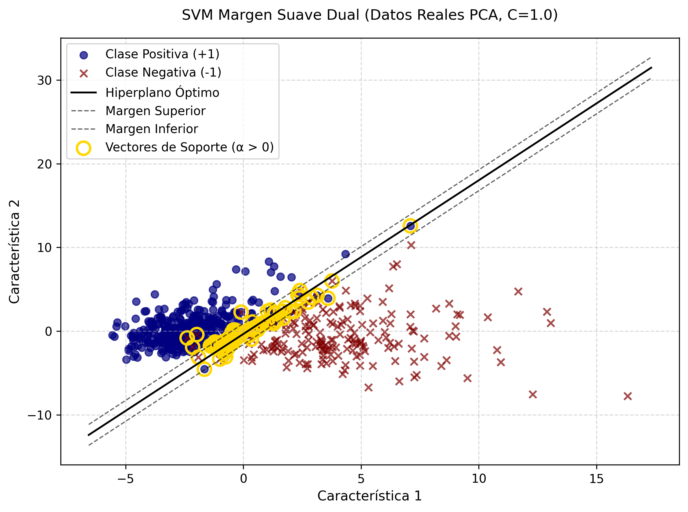

# SVM de Margen Suave (Soft Margin) - Formulación Dual

---

Este repositorio expone la culminación teórica del modelo SVM lineal mediante la implementación de la **Formulación Dual**. Al transicionar del problema primal al dual mediante los Multiplicadores de Lagrange ($\alpha$), el algoritmo revela que la frontera de decisión depende exclusivamente de un subconjunto crítico de los datos: los **Vectores de Soporte**.

## 1. Estructura del código

Este proyecto está organizado para facilitar la trazabilidad de los experimentos.

* ``src/``: Contiene el código fuente principal ([main.py](./src/main.py "Código fuente")).
* ``data/``: Almacena los resultados tabulados en formato CSV, incluyendo los multiplicadores de Lagrange.
* ``images/``: Contiene la visualización de los hiperplanos y los vectores de soporte identificados.

## 2. Guía de Ejecución

### Requisitos Previos

Asegúrese de tener instalado el entorno de Python con las bibliotecas necesarias:

```bash
pip install numpy pandas scipy matplotlib scikit-learn
```

### Ejecución

Para evaluar la capacidad del modelo frente a los tres escenarios de complejidad creciente (separables, superpuestos y empíricos), ejecute:

```bash
cd src
python main.py
```

## 3. Descripción del Código

El sistema demuestra la elegancia de optimizar en el espacio de los multiplicadores de Lagrange en lugar del espacio de características original.

### Formulación Matemática

* *Función Objetivo (a Maximizar):*

  $\max_{\alpha} \sum_{i} \alpha_i - \frac{1}{2} \sum_{i} \sum_{j} \alpha_i \alpha_j y_i y_j (x_i^T x_j)$
* *Restricciones:*

  $\sum_{i} \alpha_i y_i = 0$
  $0 \leq \alpha_i \leq C, \quad \forall i$

Donde:

* $\alpha_i$ son los Multiplicadores de Lagrange.
* $C$ es la penalización de margen suave.
* $x_i^T x_j$ representa el producto punto (Kernel lineal) entre las muestras.
* $y_i \in \{-1, 1\}$ son las etiquetas de clase. _(Nota técnica: El uso algebraico de +1 y -1 es el catalizador que permite formular el producto de las etiquetas $y_i y_j$ en la matriz Hessiana, posibilitando la optimización convexa)._

### Funciones Principales

* `fit_dual_soft_margin()`: Construye la matriz Hessiana y ajusta el modelo minimizando la forma cuadrática del problema dual con `SLSQP`. Reconstruye los pesos $w$ y el sesgo $b$ a partir de los $\alpha$ óptimos.
* `plot_svm()`: Visualiza la frontera y resalta, mediante anillos dorados, exclusivamente a los Vectores de Soporte ($\alpha_i > 0$).

## 4. Análisis de Resultados

El experimento demuestra la robustez del Margen Suave y la esparsidad inherente a su Formulación Dual.

### Escenarios de Prueba

| Escenario                                | Resultado            | Interpretación                                                                                                                   |
| ---------------------------------------- | -------------------- | --------------------------------------------------------------------------------------------------------------------------------- |
| Datos separables<br />(Sintético)       | Convergencia exitosa | Solo los puntos estrictamente en los bordes del margen resultan tener $\alpha > 0$.                                            |
| Datos superpuestos<br />(Sintético)     | Convergencia exitosa | Los puntos dentro del margen (infracciones) alcanzan la restricción superior de caja ($\alpha = C$).                           |
| Breast Cancer Wisconsin<br />(Empírico) | Convergencia exitosa | Demostración práctica: El algoritmo identifica exitosamente los vectores de soporte estructurales en datos oncológicos reales. |

<div style="display: flex; flex-direction: row; justify-content: space-between;">
  
  
  
</div>

* **Interpretación de los hallazgos:** La formulación dual prueba empíricamente la propiedad de **parsimonia** (esparsidad) de la SVM. Como se observa en los gráficos, la inmensa mayoría de los puntos de entrenamiento reciben un $\alpha = 0$, siendo completamente ignorados para el cálculo final del hiperplano. Únicamente los puntos resaltados en dorado dictan la posición geométrica de la frontera.

### Conexión Primal-Dual (Condiciones KKT) y Dualidad Fuerte

Al contrastar la inspección visual de este modelo dual con la formulación primal, se evidencia empíricamente el cumplimiento de la **Dualidad Fuerte** mediante las condiciones de Karush-Kuhn-Tucker (KKT).

Mientras que el modelo primal resaltaba exclusivamente las infracciones toleradas (holgura $\xi_i > 0$), este modelo dual revela la **arquitectura estructural completa**, iluminando todos los vectores de soporte ($\alpha_i > 0$). Analizando los multiplicadores exportados en los archivos CSV, podemos clasificar estos puntos dorados en dos categorías matemáticas:

1. **Vectores de Soporte Libres ($0 < \alpha_i < C$):** Puntos que descansan con precisión milimétrica sobre las líneas del margen perfecto. En el modelo primal, su variable de holgura es estrictamente cero.
2. **Vectores de Soporte Ligados ($\alpha_i = C$):** Puntos que saturan la restricción de caja. Corresponden exactamente a las muestras que han invadido el margen o cruzado el hiperplano (aquellos donde $\xi_i > 0$ en el modelo primal).

Esta distinción gráfica demuestra que la formulación dual no solo halla la misma frontera óptima, sino que expone la importancia jerárquica de cada dato en el espacio de entrenamiento.

## 5. Conclusión

Resolver el problema SVM a través de su modelo Dual no es un mero ejercicio algebraico, sino la llave maestra del aprendizaje estadístico avanzado. Al demostrar que la solución depende estrictamente del producto punto de los vectores de entrada ($x_i^T x_j$), esta implementación sienta las bases matemáticas irrefutables para la introducción posterior de Funciones Kernel, permitiendo proyectar datos hacia dimensiones infinitas sin incrementar la complejidad computacional.

---

⌨️ made with ❤️ by [Gustavo Rivero](https://github.com/gustavoerivero)
