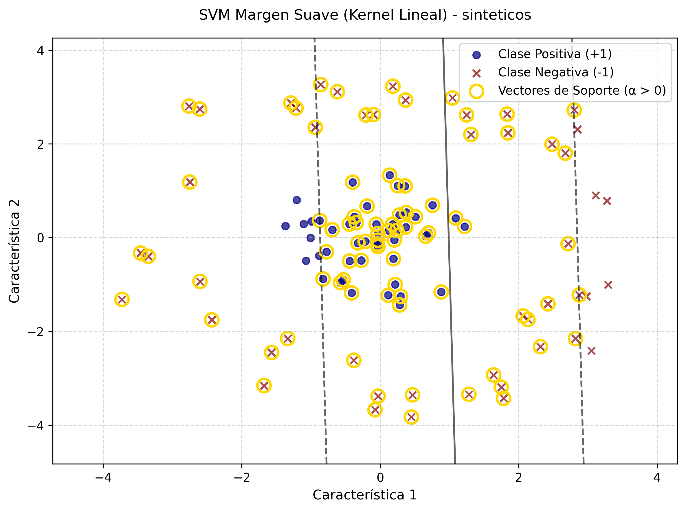
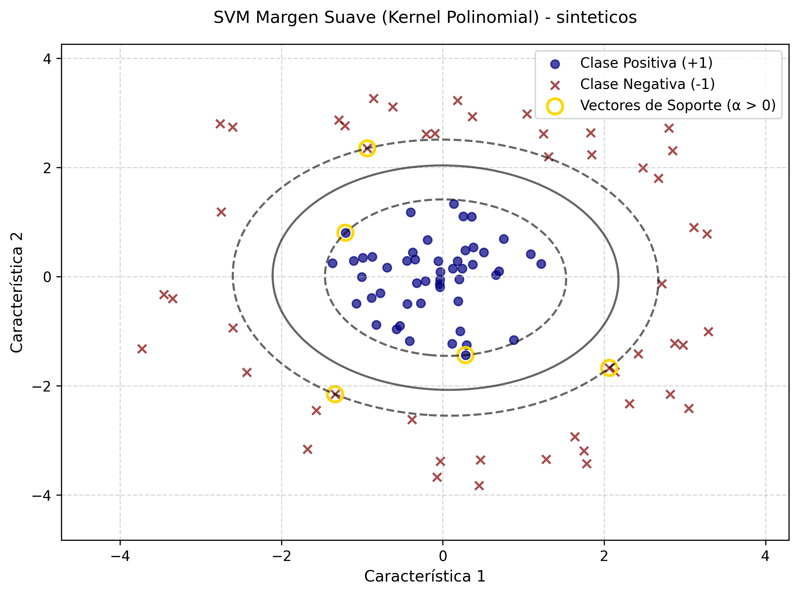
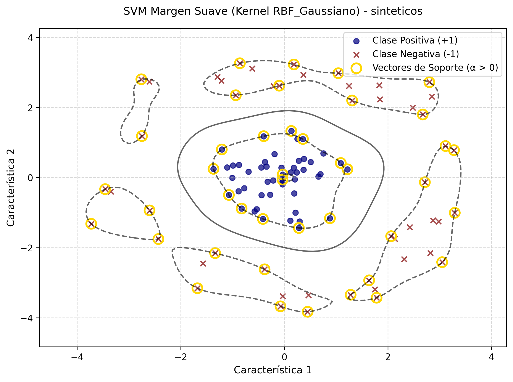
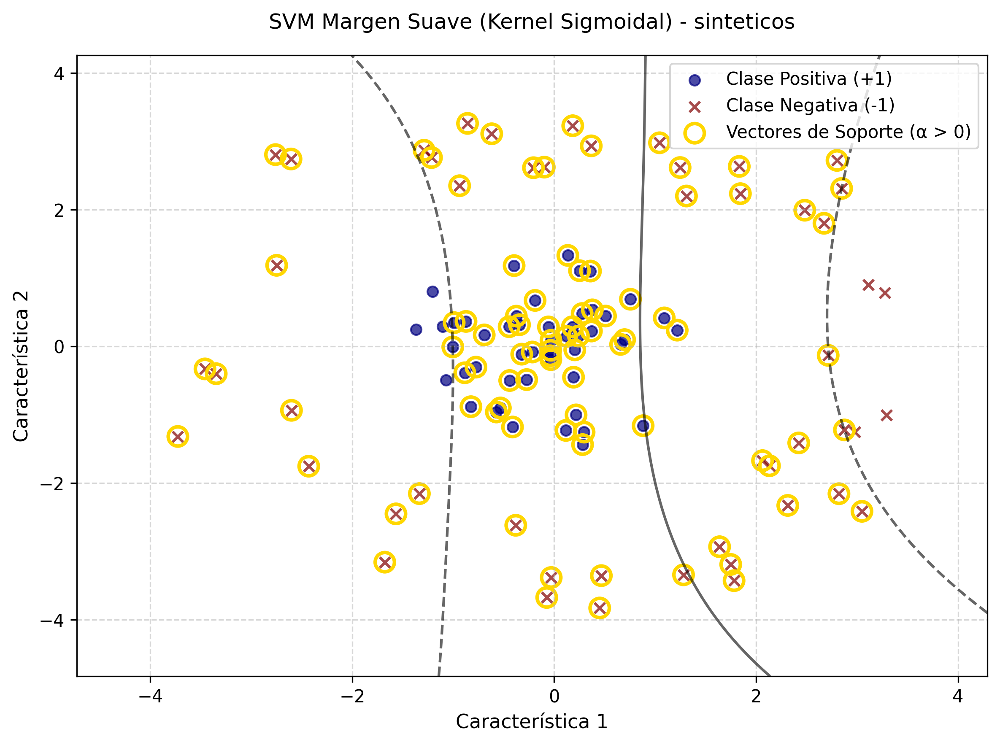
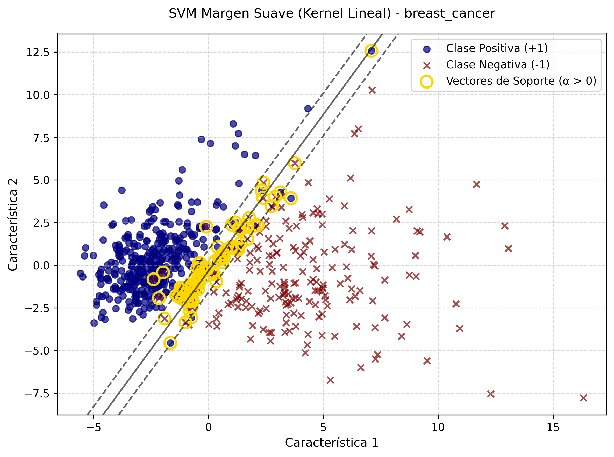
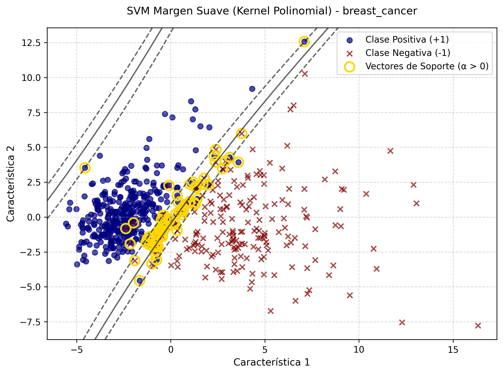
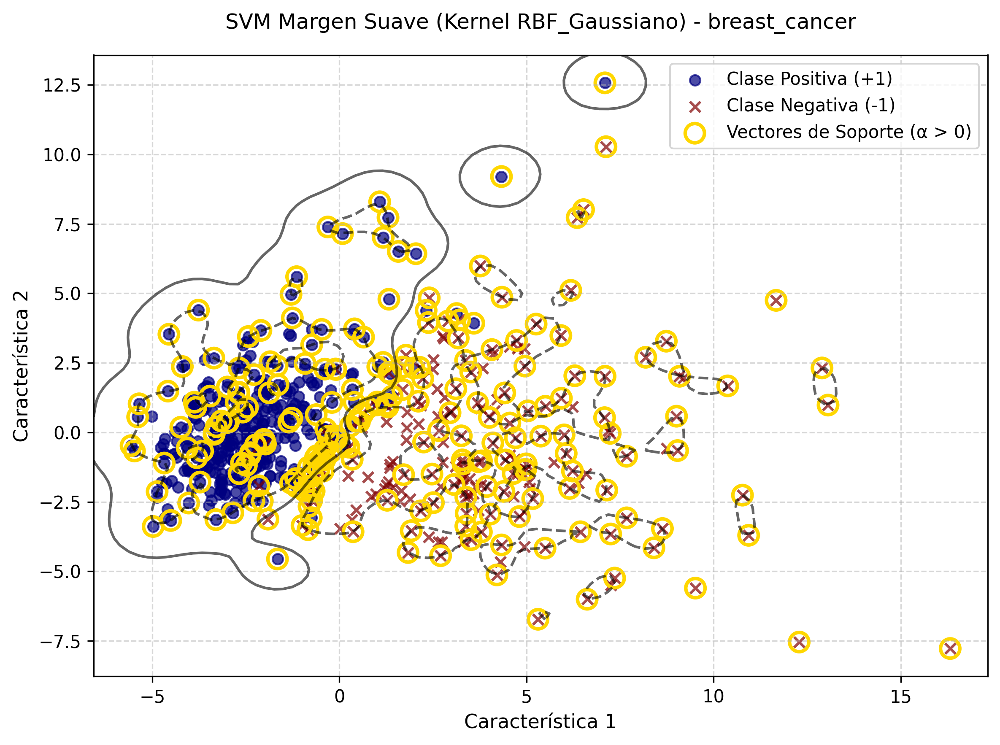
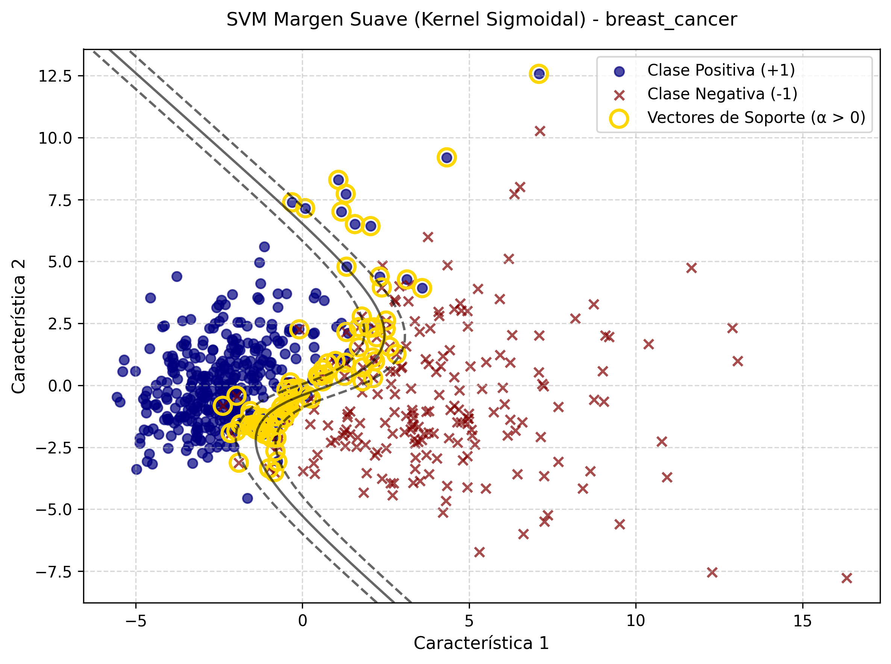
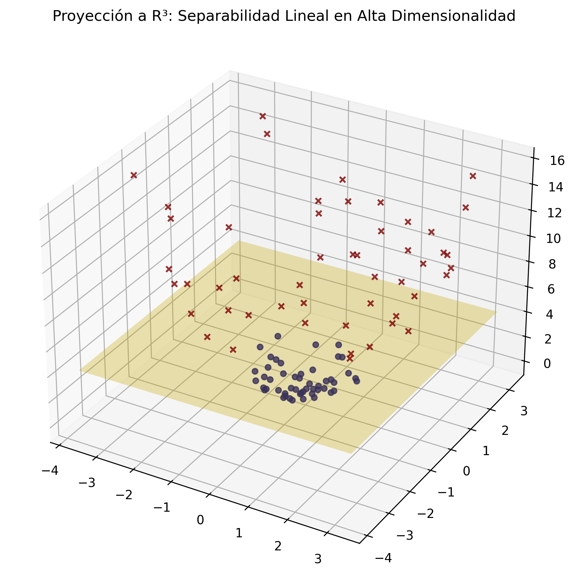

# SVM - Funciones Kernel

---

Este repositorio documenta la evolución del modelo SVM Dual mediante la inyección de **Funciones Kernel**. Basado en el Teorema de Mercer, este avance matemático permite sustituir el producto punto estándar para mapear los datos hacia espacios de mayor dimensionalidad. Esto hace posible la construcción de fronteras de decisión no lineales complejas sin incurrir en el costo computacional prohibitivo de transformar explícitamente el espacio de características originales.

## 1. Estructura del código

Este proyecto está organizado para facilitar la trazabilidad de los experimentos y las auditorías de rendimiento.

* `src/`: Contiene el código fuente principal ([main.py](./src/main.py "Código fuente")).
* `data/`: Almacena los resultados de clasificación y los reportes maestros de *benchmarking* (Métricas de Tiempo, Precisión y Vectores de Soporte) en formato CSV y Excel.
* `images/`: Contiene la visualización de las fronteras de decisión mediante contornos en 2D y la demostración explícita del hiperplano en $\mathbb{R}^3$.

## 2. Guía de Ejecución

### Requisitos Previos

Asegúrese de tener instalado el entorno de Python con las bibliotecas necesarias:

```bash
pip install numpy pandas scipy matplotlib scikit-learn
```

### Ejecución

Para evaluar la capacidad del modelo frente a los tres escenarios de complejidad creciente (separables, superpuestos y empíricos), ejecute:

```bash
cd src
python main.py
```

## 3. Descripción del Código

El sistema demuestra la elegancia de optimizar en el espacio de los multiplicadores de Lagrange en lugar del espacio de características original.

### Formulación Matemática

* **Función Objetivo (a Maximizar):** $\max_{\alpha} \sum_{i} \alpha_i - \frac{1}{2} \sum_{i} \sum_{j} \alpha_i \alpha_j y_i y_j K(x_i, x_j)$
* *Restricciones:*

  $\sum_{i} \alpha_i y_i = 0$
  $0 \leq \alpha_i \leq C, \quad \forall i$
* **Catálogo de Núcleos $K$ ($x_i$, $x_j$) implementados:**
* **Lineal:** $x_i^T x_j$
* **Polinomial:** $(\gamma x_i^T x_j + r)^d$
* **Gaussiano (RBF):** $\exp(-\gamma ||x_i - x_j||^2)$
* **Sigmoidal:** $\tanh(\gamma x_i^T x_j + r)$

### Funciones Principales

* `fit_kernel_svm()`: Optimiza el problema dual inyectando dinámicamente la función Kernel seleccionada.
* `evaluate_kernels()`: Ejecuta una auditoría de rendimiento (Benchmark) recolectando tiempos de ejecución, precisión algorítmica y esparsidad (tasa de retención de Vectores de Soporte).
* `plot_3d_mapping()`: Función didáctica que proyecta explícitamente un conjunto no lineal en $\mathbb{R}^2$ hacia $\mathbb{R}^3$ para visualizar cómo un hiperplano rígido puede seccionar topologías intrincadas.

## 4. Análisis de Resultados

El experimento evalúa el comportamiento topológico y el costo computacional de los núcleos frente a datos geométricamente complejos, revelando que la elección del Kernel es un problema de optimización en sí mismo.

### Benchmarking Computacional: Evaluación de Precisión y Parsimonia

La siguiente tabla consolida la auditoría de rendimiento algorítmico, detallando el balance entre la precisión del modelo, el tiempo de procesamiento y la tasa de Vectores de Soporte requeridos (parsimonia).

#### Evaluación I: Datos Sintéticos (Topología Circular en R²)

| Núcleo (Kernel) | Tiempo de Entrenamiento | Retención de Vectores de Soporte | Precisión (%) | Interpretación Geométrica |
| :--- | :--- | :--- | :--- | :--- |
| **Lineal** | $0.0602$ s | $87\%$ ($87 / 100$) | $73.0\%$ | **Fallo estructural.** Corta el espacio de manera rígida, forzando al modelo a utilizar casi todos los datos como soporte para minimizar la pérdida sin lograr convergencia. |
| **Polinomial (d=2)** | $0.0452$ s | **$5\%$ ($5 / 100$)** | **$100.0\%$** | **Ajuste óptimo.** Aprovecha la naturaleza cuadrática inherente de los círculos, modelando la frontera perfecta con extrema esparsidad. |
| **RBF (Gaussiano)** | $0.0651$ s | $42\%$ ($42 / 100$) | $100.0\%$ | **Ajuste altamente flexible.** Logra precisión total, pero a costa de una parsimonia considerablemente menor en comparación con el núcleo polinomial. |
| **Sigmoidal** | $0.0805$ s | $92\%$ ($92 / 100$) | $72.0\%$ | **Fallo estructural.** Al igual que el modelo lineal, es incapaz de capturar la topología cerrada de los clústeres. |

#### Evaluación II: Datos Empíricos (Breast Cancer Wisconsin en PCA 2D)

| Núcleo (Kernel) | Tiempo de Entrenamiento | Retención de Vectores de Soporte | Precisión (%) | Interpretación Empírica |
| :--- | :--- | :--- | :--- | :--- |
| **Lineal** | $4.6318$ s | $13.53\%$ ($77 / 569$) | $95.43\%$ | **Balance ideal.** Logra una excelente precisión computando rápidamente un hiperplano robusto que no memoriza el ruido. |
| **Polinomial (d=2)** | $4.1821$ s | $13.18\%$ ($75 / 569$) | $95.43\%$ | **Equivalencia.** Se comporta de forma casi idéntica al modelo lineal en este espacio reducido, manteniendo una excelente parsimonia. |
| **RBF (Gaussiano)** | $17.1007$ s | **$42.00\%$ ($239 / 569$)** | **$96.13\%$** | **Costo del sobreajuste.** Gana menos de $1\%$ en precisión respecto al modelo lineal, pero cuadriplica el tiempo de entrenamiento y retiene casi la mitad del dataset, indicando riesgo de sobreajuste. |
| **Sigmoidal** | $5.2134$ s | $14.94\%$ ($85 / 569$) | $90.86\%$ | **Subóptimo.** Su arquitectura en forma de 'S' introduce distorsiones en este espacio de características. |

### Galería de Topologías No Lineales y Proyecciones

A continuación se presentan las visualizaciones de las fronteras de decisión generadas, divididas por el nivel de complejidad del experimento. Esto permite observar directamente cómo cada uno de los cuatro núcleos distorsiona el espacio geométrico subyacente.

#### 1. Evaluación Topológica: Datos Sintéticos (Clústeres Circulares)
<table style="width: 100%; text-align: center;">
  <tr>
    <td style="width: 50%;">
      <b>Kernel Lineal (Fallo)</b><br>
      
    </td>
    <td style="width: 50%;">
      <b>Kernel Polinomial</b><br>
      
    </td>
  </tr>
  <tr>
    <td>
      <b>Kernel RBF (Gaussiano)</b><br>
      
    </td>
    <td>
      <b>Kernel Sigmoidal (Fallo)</b><br>
      
    </td>
  </tr>
</table>

#### 2. Evaluación Empírica: Breast Cancer Wisconsin (Reducción PCA)
<table style="width: 100%; text-align: center;">
  <tr>
    <td style="width: 50%;">
      <b>Kernel Lineal</b><br>
      
    </td>
    <td style="width: 50%;">
      <b>Kernel Polinomial</b><br>
      
    </td>
  </tr>
  <tr>
    <td>
      <b>Kernel RBF (Gaussiano)</b><br>
      
    </td>
    <td>
      <b>Kernel Sigmoidal</b><br>
      
    </td>
  </tr>
</table>

#### 3. Demostración Matemática: El Teorema de Mercer
<div style="text-align: center;">
  <b>Proyección a R³ (Separabilidad Lineal en Alta Dimensionalidad)</b><br>
  
</div>

* **Interpretación de los hallazgos:** La auditoría numérica y visual demuestra empíricamente que no existe un "Núcleo Universal". Núcleos de dimensionalidad infinita como el RBF pueden modelar virtualmente cualquier frontera (como se aprecia en los intrincados contornos cerrados del conjunto oncológico), pero a expensas de la esparsidad y la velocidad, incrementando el riesgo de sobreajuste (*overfitting*). Para conjuntos de datos empíricos de alta varianza, modelos más rígidos (Lineal o Polinomial de bajo grado) ofrecen una parsimonia y generalización notablemente superiores.

## 5. Conclusión

La transición hacia el uso de Funciones Kernel representa el cénit de la elegancia en la clasificación lineal. Al delegar la evaluación geométrica puramente en el producto modificado de los datos de entrada, la Máquina de Vectores de Soporte trasciende las limitaciones topológicas originales. La evaluación empírica corrobora que el éxito de una SVM en el mundo real radica en seleccionar el núcleo matemático que mejor se adapte a la naturaleza intrínseca de los datos, balanceando con precisión la frontera de decisión y el costo computacional.

---

⌨️ made with ❤️ by [Gustavo Rivero](https://github.com/gustavoerivero)
