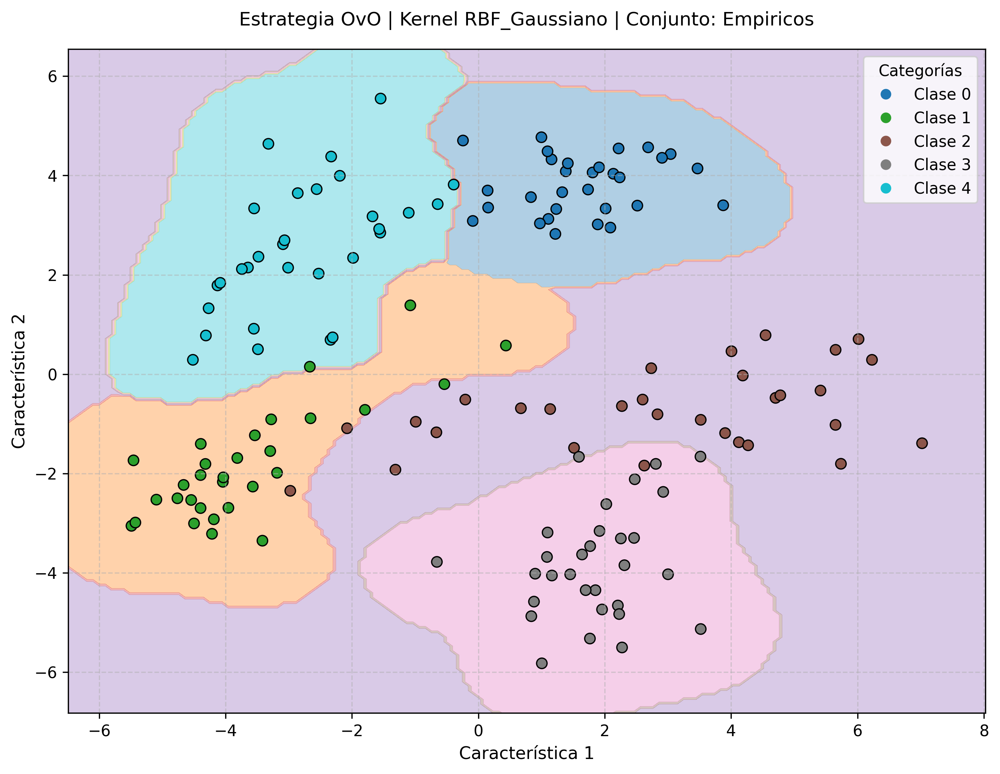
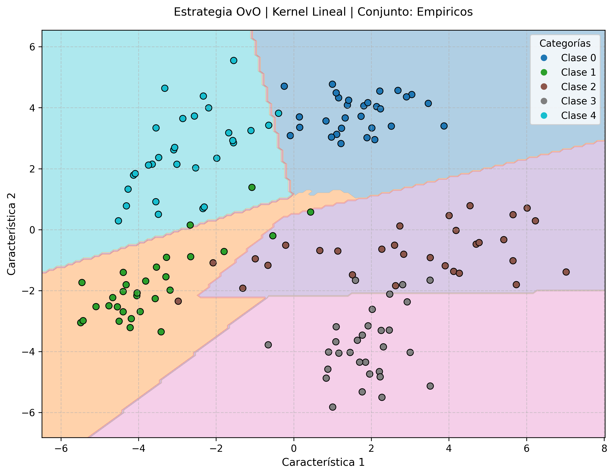
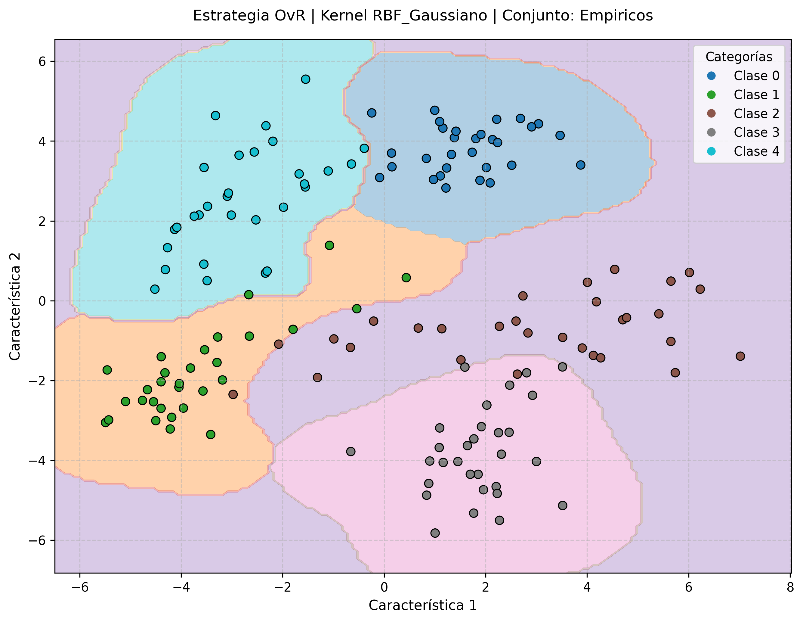
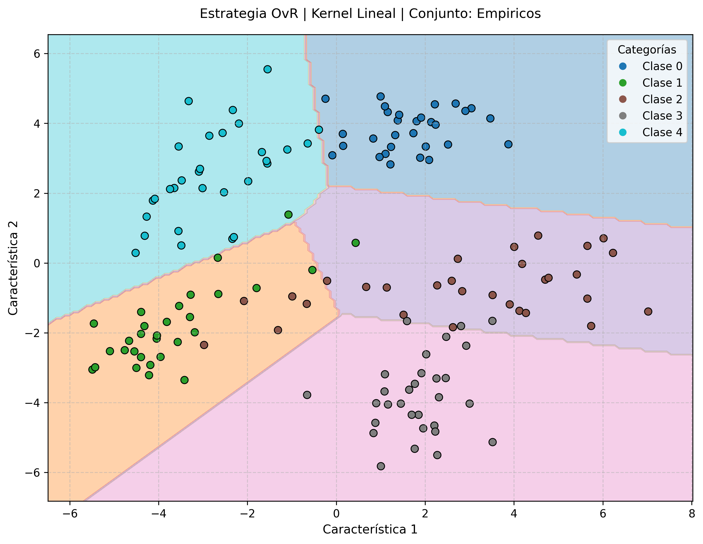

# Estrategias Multiclase con SVM

---

Este repositorio corresponde a la extensión de la Máquina de Vectores de Soporte (SVM) desde su naturaleza estrictamente binaria hacia la resolución de problemas de clasificación de múltiples categorías. Para ello, se implementan y evalúan las dos estrategias estándar de la industria: **Uno-contra-Todos (One-vs-Rest, OvR)** y **Uno-contra-Uno (One-vs-One, OvO)**.

## 1. Estructura del código

Este proyecto está organizado para facilitar la trazabilidad de los experimentos y las auditorías de rendimiento.

* `src/`: Contiene el código fuente principal y la lógica de envoltura multiclase ([main.py](./src/main.py "Código fuente")).
* `data/`: Almacena las matrices de *benchmarking* comparativo y los registros detallados de inferencia (márgenes y votos) en formato CSV y Excel.
* `images/`: Contiene el mapeo topográfico de las regiones de decisión multiclase en el espacio de características.

## 2. Guía de Ejecución

### Requisitos Previos

Asegúrese de tener instalado el entorno de Python con las bibliotecas necesarias:

```bash
pip install numpy pandas scipy matplotlib scikit-learn
```

### Ejecución

Para evaluar la capacidad del modelo frente a los tres escenarios de complejidad creciente (separables, superpuestos y empíricos), ejecute:

```bash
cd src
python main.py
```

## 3. Descripción de las Estrategias

Dado que la función de decisión de la SVM ($y_i \in \{-1, 1\}$) es inherentemente binaria, se requieren capas lógicas superiores para procesar topologías de $N$ clases.

* **Uno-contra-Todos (OvR, One-vs-Rest):**
  * Entrena exactamente $N$ modelos.
  * Cada clasificador se entrena separando una clase específica contra _todas las demás agrupadas_.
  * El dato se evalúa en los $N$ modelos. La predicción final corresponde a la clase cuyo modelo arrojó el valor de decisión (margen) positivo más alto.
* **Uno-contra-Uno (OvO, One-vs-One):**
  * Entrena un modelo por cada combinación posible de pares de clases: $\frac{N(N-1)}{2}$  clasificadores.
  * Cada clasificador se especializa únicamente en separar dos clases, ignorando el resto del conjunto de datos.
  * El dato atraviesa todos los clasificadores; cada uno emite un voto. La predicción final recae sobre la clase con la mayor sumatoria de votos.

### Funciones Principales

* `MultiClassSVM`: Clase orientada a objetos que orquesta dinámicamente el ensamblaje de modelos según la estrategia seleccionada.
* `run_multiclass_benchmarks()`: Ejecuta una auditoría de rendimiento recolectando tiempos de ejecución y precisión de clasificación.
* `export_detailed_predictions()`: Exporta el desglose analítico de cada inferencia para garantizar la transparencia y trazabilidad de los votos y márgenes generados.
* `plot_multiclass_boundaries()`: Mapea el área bidimensional coloreando las zonas de decisión multicategoría.

## 4. Análisis de Resultados

El experimento evalúa el rendimiento algorítmico y temporal de ambas estrategias, cruzándolas con las funciones kernel Lineal y Gaussiana (RBF) sobre un conjunto de 5 clases.

### Naturaleza del conjunto de datos (Digits PCA 2D)

Para la validación en un escenario multiclases, se descarta el conjunto _Breast Cancer_ (por ser estrictamente binario) y se adopta el conjunto de datos estándar de la industria **Optical Recognition of Handwritten Digits**.

* **Composición:** Se filtran exclusivamente las imágenes correspondientes a los números del $0$ al $4$, garantizando un problema de $5$ clases.
* **Preprocesamiento:** Dado que cada imagen original consiste en un vector de $64$ características (píxeles $8 x 8$), se aplica el algoritmo de Análisis de Componentes Principales (PCA) para comprimir la varianza fundamental hacia un espacio $\mathbb{R}^2$, posibilitando así la observación geométrica de las fronteras de decisión y las áreas de superposición.

### Evaluación Empírica: Reconocimiento de Dígitos (Digits PCA 2D)

| Estrategia    | Núcleo (Función Kernel) | Modelos Entrenados | Tiempo (segundos) | Precisión (%) |
| :------------ | :------------------------ | :----------------- | :---------------- | :------------- |
| **OvR** | Lineal                    | 5                  | 0.6332 s          | 93.33%         |
| **OvR** | RBF (Gaussiano)           | 5                  | 1.4366 s          | 96.00%         |
| **OvO** | Lineal                    | 10                 | 0.1200 s          | 92.67%         |
| **OvO** | RBF (Gaussiano)           | 10                 | 0.1871 s          | 96.00%         |

### Galería de Mapeo Multiclase

A continuación, se visualiza la segmentación del espacio en 5 regiones distintas según la estrategia y el función kernel empleada.

<table style="width: 100%; text-align: center;">
  <tr>
    <td style="width: 50%;">
      <b>Estrategia OvO (Kernel RBF Gaussiano)</b><br>
      
    </td>
    <td style="width: 50%;">
      <b>Estrategia OvO (Kernel Lineal)</b><br>
      
    </td>
  </tr>
  <tr>
    <td>
      <b>Estrategia OvR (Kernel RBF Gaussiano)</b><br>
      
    </td>
    <td>
      <b>Estrategia OvR (Kernel Lineal)</b><br>
      
    </td>
  </tr>
</table>

* **Interpretación de los hallazgos:** La evaluación de tiempos de ejecución y rendimiento algorítmico demuestra una superioridad absoluta de la estrategia Uno-contra-Uno (OvO). Pese a que OvO debe entrenar y ensamblar el doble de clasificadores en este caso (10 modelos) en comparación con OvR (5 modelos), la estrategia OvO resuelve el sistema casi 8 veces más rápido (0.18 segundos frente a 1.43 segundos), manteniendo la misma precisión (96.00%). Esto se debe a que la complejidad temporal de la optimización cuadrática en una SVM escala de forma no lineal con el número de muestras $O(N^3)$. La estrategia OvR obliga a cada modelo a procesar el $100\%$ del conjunto de datos, lo que termina saturando la matriz Hessiana. En contraparte, OvO divide el problema; cada uno de sus 10 modelos solo procesa una pequeña fracción del conjunto de datos (los datos de solo 2 clases a la vez), resultando en operaciones matriciales bastante pequeñas y eficientes. En el contexto de SVM, es computacionalmente más económico resolver múltiples problemas pequeños que unos pocos problemas masivos.

## 5. Conclusión

La arquitectura de la Máquina de Vectores de Soporte demuestra una versatilidad excepcional al escalar hacia topologías de clasificación complejas. A través de este análisis empírico, se corrobora que la eficiencia en la inteligencia artificial clásica no solo depende del núcleo matemático empleado, sino del enfoque estructural de la optimización. La implementación de la estrategia Uno-contra-Uno (OvO) se consagra como el estándar técnico óptimo, demostrando que la disección de un problema multiclase en micro-modelos binarios independientes maximiza la velocidad de convergencia convexa sin sacrificar la exactitud predictiva del sistema.

---

⌨️ made with ❤️ by [Gustavo Rivero](https://github.com/gustavoerivero)
